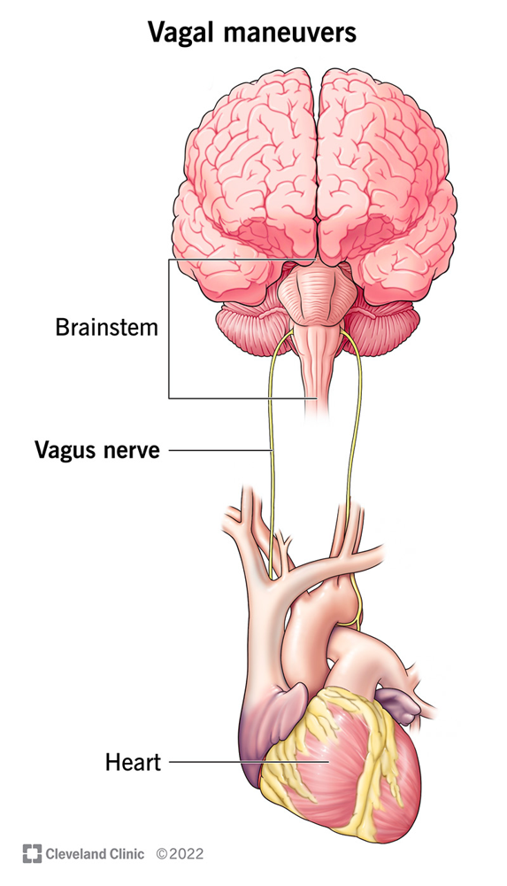

# Natural Strategies to Reduce Daytime Arrhythmias

This document presents a comprehensive analysis of natural approaches to managing daytime arrhythmias. The content originated from an in-depth conversation with ChatGPT (using the `o3` model in `Deep research` mode). This initial research was subsequently imported into Google NotebookLM as a knowledge source, which then served as the foundation for generating **all** multimedia documents contained in this folder.

What follows is the relevant portion of that conversation, with personal details anonymized for privacy purposes. The exchange that sparked this analysis began as follows:

**ChatGPT:** Thanks for sharing all that detail—very helpful. Just to clarify before I begin the research:

1. Are you specifically looking for natural supplements or lifestyle practices (like breathing techniques or yoga) to reduce or prevent daytime arrhythmias?
2. Are there any medications you're currently taking that I should be aware of to avoid supplement conflicts?
3. Do you prefer supplements available in Canada (Ontario) and over-the-counter?

Once I have this, I’ll look into natural strategies and supplements that may help reduce your intermittent arrhythmia episodes safely.

**User:** I'm only taking Crestor replacement and some supplements like CQ10, garlic for heart, fish oil, vitamin B, vitamin D. I'm also taking cherry tart and zinc and sometimes I take this Japanese mushroom AHCC. I hope there are no side effects there and I'm also taking 1200mg curcumin pills at least four to five days a week so hope that doesn't influence too and it has no side effects and I'm also taking “PS brain” supplements about five days a week to help me think more clearly because I'm competing with kids half my age so I don't know if there are any side effects there as well. Of course supplements have to be made in Canada. Lifestyle practice changes are good as well, and cheaper than supplements. I already take too many, I guess. What would you recommend? Cou can give me multiple approaches.

**ChatGPT:** Thanks, I’ll look into natural, low-risk strategies—including supplements available in Canada and lifestyle practices—to help reduce or prevent daytime arrhythmias. I'll also keep an eye on potential interactions with what you're currently taking, like CoQ10, garlic, fish oil, curcumin, and PS Brain. I'll share multiple approaches so you can choose what fits best with your current routine and goals.

## Introduction and Background

A middle-aged Canadian man is experiencing occasional daytime arrhythmias (irregular heartbeats) that tend to occur after long workdays or periods of intense mental focus. He has **no diagnosed heart disease**, no hypertension on 72-hour monitoring, and only brief arrhythmia episodes (<1 minute). His history includes mild sleep apnea (now well-managed with CPAP). He wishes to avoid medical procedures and instead explore **natural methods** to reduce or prevent these arrhythmias.

This report addresses four key areas:

- **Evidence-based supplements** that may reduce arrhythmia frequency (with suggested dosages, mechanisms, and safety considerations).
- **Low-cost lifestyle interventions** – including breathing exercises, physical activity, sleep hygiene, and stress reduction techniques – to stabilize heart rhythm.
- **Canadian-available supplement brands** and products that can be obtained in Ontario without a prescription.
- A **review of his current supplement stack** (listed below) for any impacts on heart rhythm or potential interactions, with advice on whether to continue or adjust them.

**Current Supplements:**  
*(He is currently taking the following: “Crestor replacement” (an unspecified statin alternative), CoQ10, garlic extract, fish oil, Vitamin B complex, Vitamin D, tart cherry extract, zinc, AHCC (mushroom extract), curcumin (1200 mg, 4–5 times/week), and a “PS Brain” supplement containing ashwagandha, bacopa, and phosphatidylserine.)*

---

## Evidence-Based Supplement Options for Heart Rhythm Support

Research suggests several nutrients and herbal supplements can support healthy heart rhythm **naturally**. While none are a guaranteed “cure” for arrhythmia, they may reduce frequency or severity of episodes when used alongside a healthy lifestyle ([Supplements for Arrhythmia: What to Take and Safety Considerations](https://www.healthline.com/health/arrhythmia-dietary-supplement#:~:text=While%20certain%20nutrients%20can%20support,check%20with%20a%20doctor%20first)) ([Supplements for Arrhythmia: What to Take and Safety Considerations](https://www.healthline.com/health/arrhythmia-dietary-supplement#:~:text=While%20certain%20nutrients%20can%20certainly,and%20procedures%20that%20manage%20arrhytmias)). Always consult a doctor before starting new supplements, especially with heart conditions ([Supplements for Arrhythmia: What to Take and Safety Considerations](https://www.healthline.com/health/arrhythmia-dietary-supplement#:~:text=A%202022%20study%20in%20the,ideal%2C%20supplementation%20may%20be%20helpful)). Key supplements to consider include:

- **Magnesium:** This mineral is crucial for normal electrical activity in the heart. Low magnesium is linked to increased arrhythmia risk, and supplementing can stabilize heart rhythms ([Arrythmias: Types, Causes & Treatments - Life Extension](https://www.lifeextension.com/protocols/heart-circulatory/arrhythmias?srsltid=AfmBOorShj3gi5V9y2hq3xLVSgvGG373fozmf3vUr8QAyW8vpy5wnLOO#:~:text=As%20both%20magnesium%20and%20potassium,Sultan%202012)) ([Arrythmias: Types, Causes & Treatments - Life Extension](https://www.lifeextension.com/protocols/heart-circulatory/arrhythmias?srsltid=AfmBOorShj3gi5V9y2hq3xLVSgvGG373fozmf3vUr8QAyW8vpy5wnLOO#:~:text=of%20imminent%20ventricular%20tachyarrhythmia%2C%20even,Falco%202012)). In a clinical trial, **~300–400 mg of elemental magnesium daily** (e.g. magnesium glycinate or magnesium taurate) significantly reduced irregular beats in heart patients compared to placebo ([Cardiac Arrhythmia (Holistic) – Health Information Library | PeaceHealth](https://www.peacehealth.org/medical-topics/id/hn-1182007#:~:text=Supplementing%20with%20magnesium%20may%20help,the%20number%20of%20arrhythmic%20episodes)). Magnesium helps by calming over-excitable heart muscle cells and aiding proper nerve signaling. It’s generally safe, but high doses may cause diarrhea – start around 200 mg and increase gradually. People with kidney issues should consult a doctor first, and any use of magnesium for arrhythmia should be under medical supervision ([Cardiac Arrhythmia (Holistic) – Health Information Library | PeaceHealth](https://www.peacehealth.org/medical-topics/id/hn-1182007#:~:text=found%20to%20be%20associated%20with,of%20magnesium%20for%20cardiac%20arrhythmia)).

- **Potassium:** An electrolyte working hand-in-hand with magnesium for cardiac rhythm. Even mild **potassium deficiency** can trigger arrhythmias ([Supplements for Arrhythmia: What to Take and Safety Considerations](https://www.healthline.com/health/arrhythmia-dietary-supplement#:~:text=Potassium)). If blood tests show low potassium, doctors often recommend correcting it to resolve rhythm issues ([Supplements for Arrhythmia: What to Take and Safety Considerations](https://www.healthline.com/health/arrhythmia-dietary-supplement#:~:text=If%20you%20have%20low%20potassium%2C,the%20severity%20of%20their%20arrhythmia)). High-potassium foods (bananas, avocados, leafy greens, beans, coconut water) are a safe first approach. Over-the-counter potassium supplements in Canada are typically low-dose (e.g. 99 mg) due to safety limits – higher doses should be taken only under medical guidance ([Cardiac Arrhythmia (Holistic) – Health Information Library | PeaceHealth](https://www.peacehealth.org/medical-topics/id/hn-1182007#:~:text=Potassium)). **Aim for ~4.7 g/day from diet**, and if a supplement is needed (for example, if a diuretic medication has lowered potassium), do so with a doctor’s supervision ([Cardiac Arrhythmia (Holistic) – Health Information Library | PeaceHealth](https://www.peacehealth.org/medical-topics/id/hn-1182007#:~:text=In%20one%20study%2C%20people%20taking,when%20they%20supplemented%20with%20potassium)). Proper potassium levels help maintain normal heart electrical conduction.

- **Coenzyme Q10 (CoQ10):** A powerful antioxidant and mitochondrial nutrient that supports heart muscle energy. CoQ10 has been studied in cardiac patients and may help **reduce arrhythmia frequency**, particularly in people with heart failure or those on statins ([Supplements for Arrhythmia: What to Take and Safety Considerations](https://www.healthline.com/health/arrhythmia-dietary-supplement#:~:text=Coenzyme%20Q10%20is%20another%20antioxidant,with%20multiple%20health%20benefits)). For a person without heart failure, CoQ10 can still be beneficial for general heart health. A typical dose is **100–200 mg daily with food** (he’s already taking this). A 2018 study found CoQ10 supplementation improved heart rhythm stability (e.g. fewer episodes of atrial fibrillation) ([Supplements for Arrhythmia: What to Take and Safety Considerations](https://www.healthline.com/health/arrhythmia-dietary-supplement#:~:text=Coenzyme%20Q10%20is%20another%20antioxidant,with%20multiple%20health%20benefits)). It is very well tolerated; the main side effect at higher doses can be mild insomnia or upset stomach. Since he is on a “Crestor replacement” (likely a red yeast rice or similar statin-like supplement), CoQ10 is especially useful to counteract any depletion of CoQ10 caused by statin effects and to support muscle and heart function.

- **Omega-3 Fish Oil:** Omega-3 fatty acids (EPA/DHA) from fish oil reduce inflammation and support overall heart health. **Moderate doses** may have an antiarrhythmic effect ([Supplements for Arrhythmia: What to Take and Safety Considerations](https://www.healthline.com/health/arrhythmia-dietary-supplement#:~:text=A%202018%20report%20in%20BMJ,increased%20risk%20for%20atrial%20fibrillation)). For example, trials in people with frequent premature heartbeats showed fish oil (about 1 tablespoon daily, \~3–4 g omega-3) significantly reduced the frequency of abnormal beats compared to placebo ([Cardiac Arrhythmia (Holistic) – Health Information Library | PeaceHealth](https://www.peacehealth.org/medical-topics/id/hn-1182007#:~:text=In%20a%20double,did%20men%20given%20no%20supplemental)). However, evidence is mixed: some research indicates **high doses** of fish oil (over \~4 g/day) could *increase* the risk of atrial fibrillation in susceptible individuals ([Supplements for Arrhythmia: What to Take and Safety Considerations](https://www.healthline.com/health/arrhythmia-dietary-supplement#:~:text=A%202018%20report%20in%20BMJ,increased%20risk%20for%20atrial%20fibrillation)). The key is moderation: **1 g per day** of combined EPA/DHA is a common, safe dose for heart benefits. He is already taking fish oil – this likely helps calm inflammation that might irritate the heart. He should avoid mega-doses unless directed by a physician, and ensure the product is a quality, mercury-tested oil. Notably, if he has a history of bleeding issues or is on blood thinners, fish oil (and other supplements like garlic and curcumin) can slightly increase bleeding risk, so that’s something to be mindful of.

- **Antioxidant Vitamins (C and E):** Oxidative stress can contribute to cardiac irritability. Vitamins **C** and **E** are antioxidants that support blood vessel and heart health. A 2022 study indicated that supplementation with vitamins C and E helped **reduce the severity of arrhythmias** in both the atria (upper chambers) and ventricles ([Supplements for Arrhythmia: What to Take and Safety Considerations](https://www.healthline.com/health/arrhythmia-dietary-supplement#:~:text=These%20powerful%20vitamins%20are%20also,chambers%20of%20the%20heart)). Vitamin C (around 500–1000 mg daily) and vitamin E (400 IU natural mixed tocopherols) are typical supplement doses. They may be particularly useful under high oxidative stress (for example, after intense workload or poor sleep). These vitamins also support the immune system and overall wellness. C is generally very safe (excess can cause loose stools). Vitamin E at high doses (>400 IU) should be used cautiously long-term due to possible risks in some studies; sticking to moderate doses and getting mixed tocopherols (not just alpha-tocopherol) is best. Of course, a diet rich in fruits, vegetables, and nuts provides these nutrients too – supplementation is an option if diet is insufficient.

- **Hawthorn (Crataegus) Extract:** Hawthorn berry is a classic heart herb used traditionally to **steady the heartbeat and improve cardiac performance**. Modern research in Europe has used standardized hawthorn extracts in heart failure patients, finding improved exercise tolerance, fewer palpitations, and more stable heart rhythms ([Arrythmias: Types, Causes & Treatments - Life Extension](https://www.lifeextension.com/protocols/heart-circulatory/arrhythmias?srsltid=AfmBOorShj3gi5V9y2hq3xLVSgvGG373fozmf3vUr8QAyW8vpy5wnLOO#:~:text=fewer%20incidence%20of%20potentially%20deadly,Tauchert%201999)). In a 24-week clinical trial of over 1,000 patients with heart failure, hawthorn supplementation not only improved symptoms like fatigue and palpitation, but also increased the amount of time that heart rhythm remained normal ([Arrythmias: Types, Causes & Treatments - Life Extension](https://www.lifeextension.com/protocols/heart-circulatory/arrhythmias?srsltid=AfmBOorShj3gi5V9y2hq3xLVSgvGG373fozmf3vUr8QAyW8vpy5wnLOO#:~:text=fewer%20incidence%20of%20potentially%20deadly,Tauchert%201999)). Hawthorn acts by dilating coronary arteries, improving blood flow, and modulating heart muscle cell signaling (it affects calcium and potassium channels in the heart) ([Arrythmias: Types, Causes & Treatments - Life Extension](https://www.lifeextension.com/protocols/heart-circulatory/arrhythmias?srsltid=AfmBOorShj3gi5V9y2hq3xLVSgvGG373fozmf3vUr8QAyW8vpy5wnLOO#:~:text=Hawthorn%20is%20a%20fruit,Rigelsky%202002%3B%20Tadic%202008)). For this gentleman, hawthorn could help **prevent those fleeting arrhythmias**, especially if stress-induced. A typical dose is **300–600 mg of a standardized extract daily** (often divided twice a day). It’s available as capsules or tincture. Hawthorn is generally safe; side effects are rare (mild dizziness or stomach upset in some). However, if he were on heart medications like beta-blockers, nitrates or digoxin, he’d want to inform his doctor, as hawthorn can enhance their effects ([A review on plants and herbal components with antiarrhythmic ...](https://pmc.ncbi.nlm.nih.gov/articles/PMC7340875/#:~:text=,and%20it%20has%20been)). Used alone, it’s quite gentle and has a long history of use for arrhythmia support.

- **Taurine (and Other Amino Acids):** Taurine is an amino acid that stabilizes cell membranes and assists in proper ion flow (potassium, calcium, magnesium) in and out of heart cells. Some preliminary evidence and case reports suggest **taurine supplementation** may reduce ectopic beats and even atrial fibrillation episodes in people with unexplained arrhythmias ([The Antiarrhythmic Properties of Magnesium, Taurine, and L-Arginine | by Ryan Merket | Medium](https://blog.ryanmerket.com/the-antiarrhythmic-properties-of-magnesium-taurine-and-l-arginine-4edd3a5379d1#:~:text=L,5)). Taurine works synergistically with magnesium – it helps magnesium get into cells and may calm overexcited heart muscle tissue. A common dose used by practitioners is **1–3 grams of taurine daily**, often split morning and evening. It is usually very well tolerated (taurine is actually present in foods like seafood and is also used in energy drinks, but **without the caffeine** it actually tends to have a calming effect). One precaution: because taurine can slightly lower blood pressure and enhance electrolyte absorption, start at 500 mg–1 g to see how it feels. (Note: Energy drinks that combine taurine with caffeine *do* have pro-arrhythmic effects due to caffeine ([Cardiovascular risk of energy drinks: Caffeine and taurine facilitate ...](https://onlinelibrary.wiley.com/doi/10.1111/jce.15458#:~:text=Cardiovascular%20risk%20of%20energy%20drinks%3A,and%20taurine%20provoked%20ventricular%20arrhythmias)), but taurine alone as a supplement does not have caffeine and is generally considered safe for the heart.) Taurine is not yet a mainstream arrhythmia therapy, but given its low cost and potential benefit, it could be an **adjunct to discuss with a healthcare provider**. Other amino acids like **L-arginine** or **L-carnitine** have been explored for heart health, but the evidence for arrhythmia reduction is less established. Arginine may help if endothelial function is an issue (as it produces nitric oxide), and carnitine can support energy metabolism in heart cells. These might be optional considerations if other issues (like angina or arterial health) are present, but for primarily stress-related palpitations, magnesium/taurine are more directly beneficial.

- **Adaptogens and Calming Herbs:** Since his arrhythmias seem **triggered by stress and mental strain**, supplements that reduce stress hormones and support the nervous system can indirectly help the heart. He is already taking **ashwagandha and bacopa** (in his brain supplement), which is great – both are adaptogenic herbs that reduce cortisol and anxiety over time. Ashwagandha (Withania somnifera) in particular has been shown to **improve heart rate variability** and reduce stress-related surges in heart rate by calming the sympatho-adrenal system. Bacopa monnieri is known to alleviate anxiety and might slightly slow an over-elevated heart rate (it can cause mild bradycardia in some cases) ([What Is Bacopa Good for, and Are There Side Effects? - MedicineNet](https://www.medicinenet.com/what_is_bacopa_good_for_and_are_there_side_effects/article.htm#:~:text=MedicineNet%20www,Worsen%20lung)), which in his case of stress-induced palpitations is likely helpful, not harmful (just be cautious if he ever feels overly slowed pulse or dizzy – uncommon unless taken in large doses). **Phosphatidylserine (PS)** is another component of his stack; PS helps normalize cortisol spikes and improve cognitive function under stress. Overall, he should continue these as they likely make his heart *less* prone to jumping into an arrhythmia when under strain.

  Additional calming options he could consider include: **L-theanine** (100–200 mg, an amino acid from green tea that promotes relaxation without drowsiness) to take during the day when focused work might trigger adrenaline; or **herbal teas** like chamomile, passionflower, or **valerian root** in the evening to wind down (valerian also has mild anti-arrhythmic herb traditions, though mainly it aids sleep). These are not direct arrhythmia treatments but help control the underlying stress and autonomic imbalance that can provoke irregular beats.

- **Vitamin D and Others:** He is taking vitamin D, which is important for general health. There is a curious case report where correcting a vitamin D deficiency resolved a long-standing arrhythmia (sick sinus syndrome) ([Cardiac Arrhythmia (Holistic) – Health Information Library | PeaceHealth](https://www.peacehealth.org/medical-topics/id/hn-1182007#:~:text=One%20case%20report%20described%20relief,after%20supplementing%20with%20vitamin%20D)), though that’s just one case. Ensuring his vitamin D is in a healthy range (usually 1000–2000 IU daily in Canada, or per doctor’s advice based on blood levels) is wise. Vitamin D supports immune function and may reduce inflammation that could otherwise irritate the heart. **Zinc** (he’s supplementing this as well) is not directly known to affect heart rhythm (except severe zinc deficiency could harm heart muscle), but taking zinc for immunity is fine – just keep it moderate (e.g. 15–30 mg daily) to avoid copper deficiency or stomach upset. **AHCC** (the mushroom extract) similarly is aimed at immunity; it doesn’t have known direct cardiac effects, so it’s neutral for arrhythmia (aside from potentially supporting overall wellness, which indirectly helps the heart).

  One mineral to mention is **selenium**: Severe selenium deficiency can cause heart muscle problems and arrhythmias (as seen in conditions like Keshan disease), and one author has theorized that optimizing selenium might help certain arrhythmias ([Cardiac Arrhythmia (Holistic) – Health Information Library | PeaceHealth](https://www.peacehealth.org/medical-topics/id/hn-1182007#:~:text=Supplementing%20with%20selenium%20may%20improve,many%20arrhythmias)). If his multivitamin or diet has selenium (Brazil nuts are a great source), that’s sufficient – no need for a high-dose selenium supplement unless a doctor finds he’s low. Lastly, **B-complex vitamins** (he’s already on one) ensure there’s no vitamin B1 (thiamine) deficiency, which can cause heart failure and arrhythmia in extreme cases, or B12 deficiency, which can cause fatigue and cardiac stress. His B complex covers those bases – just avoid mega-doses beyond what the label suggests. One thing: some B-complex supplements contain niacin (B3) which can cause a flushing reaction; if he ever experiences flushing and a sensation of racing heart after taking it, he might switch to a “no-flush” niacin form, but generally this is a benign effect.

In summary, **top recommended supplements** to reduce daytime arrhythmias naturally would be: **Magnesium**, **CoQ10**, **(possibly) Potassium** if needed, **Omega-3 (fish oil) in moderation**, **Antioxidants (vitamins C/E)**, **Hawthorn herb**, and **Taurine**. These all have some evidence or historical use in stabilizing heart rhythm. They are available without prescription in Canada (discussed in a section below). Always pair supplements with lifestyle measures, and inform healthcare providers about them, especially since combining many can have additive effects (for example, magnesium + hawthorn + ashwagandha might all lower blood pressure a bit – beneficial if stress raises his BP, but he should be aware to stand up slowly if he feels lightheaded).

## Lifestyle Interventions for Arrhythmia Prevention

Lifestyle and daily habits have a **powerful impact on heart rhythm**. The fact that his palpitations occur after long, focused work suggests a component of stress, fatigue, or even subtle dehydration or tension. Adopting certain low-cost practices can strengthen his vagal tone (the calming input to the heart), reduce triggers, and improve heart resilience. Below are key interventions:

### Breathing Exercises and Vagus Nerve Stimulation

*Illustration: The vagus nerve connects the brainstem to the heart. Activating it (through breathing or maneuvers) engages the “rest and digest” system to slow and stabilize heart rate.*

Slow, controlled breathing is one of the simplest and most effective tools to steady the heart’s rhythm during stress. The **vagus nerve** – a major nerve of the parasympathetic nervous system – runs from the brain to the heart and controls heart rate. When activated, it signals the heart to slow down and beat more regularly ([Vagal Maneuvers: How To Slow Your Heart Rate](https://my.clevelandclinic.org/health/treatments/22227-vagal-maneuvers#:~:text=Vagal%20maneuvers%20are%20physical%20actions,your%20body%2C%20including%20heart%20rate)) ([Vagal Maneuvers: How To Slow Your Heart Rate](https://my.clevelandclinic.org/health/treatments/22227-vagal-maneuvers#:~:text=Healthcare%20providers%20can%20do%20vagal,to%20your%20healthcare%20provider%20first)). Research shows that **deep, diaphragmatic breathing** (using the belly, not just the chest) can stimulate the vagus nerve and trigger a “rest and digest” response, counteracting the adrenaline of stress ([It's not just inspiration – careful breathing can help your health | American Heart Association](https://www.heart.org/en/news/2023/07/07/its-not-just-inspiration-careful-breathing-can-help-your-health#:~:text=Breathing%20is%20affected%20by%20these,involuntary%20functions%2C%20including%20heart%20rate)). In other words, taking slow deep breaths isn’t just mentally calming – **it physically alters nerve signals to the heart to reduce palpitations** ([It's not just inspiration – careful breathing can help your health | American Heart Association](https://www.heart.org/en/news/2023/07/07/its-not-just-inspiration-careful-breathing-can-help-your-health#:~:text=Breathing%20is%20affected%20by%20these,involuntary%20functions%2C%20including%20heart%20rate)).

**Practice:** He can incorporate **breathing exercises** during breaks or at the end of a busy day. For example:

- **Resonant breathing** at ~6 breaths per minute – inhale for ~4-5 seconds, exhale for ~5-6 seconds. Even 5 minutes of this can increase vagal tone and stabilize heart rate variability.
- **4-7-8 breathing (Relaxation Breath):** Inhale through the nose for 4 seconds, hold for 7 seconds, exhale slowly through the mouth for 8 seconds. Do 4–8 cycles. This technique is known to rapidly reduce stress and heart rate if feeling palpitations.
- **Box breathing:** Inhale 4 seconds – hold 4 – exhale 4 – hold 4, then repeat. This paced breathing, often used by Navy SEALs for calm focus, can help release physical tension and steady the heartbeat.

During mentally intense focus, people sometimes **hold their breath** or breathe very shallowly (a reflex called email apnea). Encourage him to be mindful of his breathing while working – periodically doing a few deep breaths or sighs to release tension can prevent those stress-related rhythm blips. If he notices an arrhythmia coming on (assuming it’s a benign fast rhythm or extra beats, *not* severe chest-pain type), performing a gentle **Vagal maneuver** might abort it. For instance, **coughing, bearing down as if having a bowel movement (Valsalva maneuver), or even briefly splashing the face with cold water** can stimulate the vagus nerve to slow the heart ([Vagal Maneuvers: How To Slow Your Heart Rate](https://my.clevelandclinic.org/health/treatments/22227-vagal-maneuvers#:~:text=Healthcare%20providers%20often%20use%20these%3A)). The Cleveland Clinic notes that vagal maneuvers are first-line for certain supraventricular tachycardias because they’re low-risk and often effective ([Vagal Maneuvers: How To Slow Your Heart Rate](https://my.clevelandclinic.org/health/treatments/22227-vagal-maneuvers#:~:text=Why%20are%20vagal%20maneuvers%20used%3F)). However, these should be learned from a healthcare provider to ensure they’re done correctly and are appropriate for his situation. In daily practice, the **breathing exercises** and general relaxation techniques are the safest bet to keep his nervous system balanced.

### Physical Activity and Light Cardio

**Regular physical activity** strengthens the heart and can reduce the frequency of stress-related arrhythmias over time. The key is **moderation**: extreme intense exercise can in some cases trigger arrhythmias, but light-to-moderate exercise is very beneficial. Studies suggest that even adding one hour of moderate exercise per week can lower the risk of developing atrial fibrillation, the most common arrhythmia ([Even Moderate Amounts of Exercise May Reduce Risk of AF](https://heartrhythmalliance.org/afa/co/even-moderate-amounts-of-exercise-may-reduce-risk-of-af#:~:text=AF%20heartrhythmalliance,type%20of%20arrhythmia%2C%20atrial)) ([AFib: Just 1 Hour of Exercise Per Week May Lower Risk - Healthline](https://www.healthline.com/health-news/one-hour-weekly-exercise-may-lower-afib-risk#:~:text=A%20single%20hour%20of%20exercise,fibrillation%2C%20according%20to%20new%20research)). Exercise improves circulation, helps the body handle adrenaline better, and usually improves resting vagal tone (fit individuals often have lower resting heart rates and more robust “buffer” against sudden heart rhythm changes).

For him, **daily walks** and gentle aerobic exercise (cycling, swimming, elliptical) for 30 minutes most days could be ideal. This can help discharge stress built up during a long workday. If he’s been mostly sedentary while focusing mentally, taking short “activity breaks” can help: e.g. a 5-minute walk or some light stair climbing every 1–2 hours to get the blood flowing and prevent excessive adrenaline build-up. Light cardio during lunchtime or after work will release endorphins that counteract stress hormones.

Additionally, **mind-body exercises** like **yoga** or **tai chi** deserve special mention. Yoga combines mild physical activity with controlled breathing and meditation, which is a perfect recipe for arrhythmia reduction. In a clinical study on patients with paroxysmal atrial fibrillation, those who did yoga regularly had significantly fewer AF episodes and lower anxiety and depression scores ([Yoga for Paroxysmal Atrial Fibrillation: An Ancient Solution to an Emerging Problem? - American College of Cardiology](https://www.acc.org/latest-in-cardiology/articles/2014/07/18/17/24/yoga-for-paroxysmal-atrial-fibrillation-an-ancient-solution-to-an-emerging-problem#:~:text=Yoga%20training%20significantly%20reduced%20the,0.001)) ([Yoga for Paroxysmal Atrial Fibrillation: An Ancient Solution to an Emerging Problem? - American College of Cardiology](https://www.acc.org/latest-in-cardiology/articles/2014/07/18/17/24/yoga-for-paroxysmal-atrial-fibrillation-an-ancient-solution-to-an-emerging-problem#:~:text=Conclusion)). In other words, **yoga reduced arrhythmia burden and improved quality of life** ([Yoga for Paroxysmal Atrial Fibrillation: An Ancient Solution to an Emerging Problem? - American College of Cardiology](https://www.acc.org/latest-in-cardiology/articles/2014/07/18/17/24/yoga-for-paroxysmal-atrial-fibrillation-an-ancient-solution-to-an-emerging-problem#:~:text=Conclusion)). While that study was in people with a specific arrhythmia diagnosis, the principle applies generally: yoga’s stress-reduction and parasympathetic activation likely help prevent stress-induced palpitations. A gentle yoga class 1–2 times a week or even 15 minutes of stretching and breathing at home daily could make a difference. Tai chi and qigong are similar in that they are low-intensity, meditative movements known to improve autonomic balance and often recommended for cardiac rehab.

**Important:** If he’s not used to exercise, he should start gradually and choose activities he enjoys to ensure consistency. Because he has no diagnosed heart disease, there’s no formal exercise restriction – just avoid **exercise extremes** (like very heavy weightlifting with strain, or sudden sprinting without warm-up) which can transiently raise blood pressure or trigger arrhythmia in an unconditioned person. As his fitness improves, his heart will generally become *less* irritable.

### Sleep Hygiene and Stress Management

Quality **sleep** is essential for heart rhythm stability. Sleep deprivation or disrupted sleep can provoke arrhythmias by increasing sympathetic (stress) hormones. He’s already addressed a big factor: **treating his sleep apnea** with CPAP – this is excellent, because untreated apnea at night is a known trigger for atrial fibrillation and other arrhythmias. With CPAP, his nighttime oxygen and heart rate should be more stable. To further optimize sleep:

- Maintain a **consistent sleep schedule**, aiming for 7–8 hours of sleep.
- Create a relaxing pre-bed routine: dim lights, avoid intense work or screens right before bed (blue light can interfere with melatonin).
- Perhaps incorporate **mindfulness meditation** or read something calming in the evening to transition out of “work mode.” This helps prevent going to bed with a racing mind (which can translate to a racing heart).
- His tart cherry supplement is a smart addition: tart cherry is rich in melatonin and has been shown to improve sleep quality and length. Taking tart cherry extract or juice concentrate in the evening can aid sleep and recovery.

**Stress management** during the day is also crucial. Mental stress and anxiety cause surges of adrenaline and cortisol that make the heart’s electrical system more jittery. Consider techniques such as:

- **Mindfulness breaks:** Even a 5-minute break to close his eyes, do deep breathing, or practice mindfulness meditation (focusing on the present moment sensations) can reset his stress levels. Apps like Headspace or Calm have guided 5-10 minute meditations suitable for work breaks.
- **Progressive muscle relaxation:** Tensing and then relaxing muscle groups from head to toe can release physical tension after long periods of desk work. Physical tension (tight neck, shoulders) can contribute to a sense of heart pounding; consciously releasing it helps engage the parasympathetics.
- **Hobbies and downtime:** Ensuring he has non-work activities that he enjoys (music, gentle gardening, leisurely biking, time with family/pets) will buffer the chronic stress load. A well-rounded life with pleasurable activities calms the nervous system.

A helpful mindset technique is learning to **not fear the palpitations**. Often, when a person feels an arrhythmia, they become anxious about it, which releases more adrenaline and can create a vicious cycle. If his doctors have confirmed these arrhythmias are benign, he can remind himself: “This flutter is uncomfortable but I know it passes in seconds and I am okay.” Sometimes **bearing down (Valsalva)** gently as soon as an arrhythmia is felt can stop it, as mentioned. If that works for him, just knowing he has that tool can reduce the anxiety around it. By reducing the *anticipatory anxiety*, he may actually experience fewer episodes (since worrying about arrhythmias can paradoxically trigger them via stress).

Another tip: **avoid known stimulants or triggers** that can spark palpitations:

- **Caffeine:** While moderate caffeine is tolerated by many, some healthy people can get arrhythmias from even one cup of coffee ([Cardiac Arrhythmia (Holistic) – Health Information Library | PeaceHealth](https://www.peacehealth.org/medical-topics/id/hn-1182007#:~:text=Drinking%20too%20much%20caffeine%20has,as%20one%20cup%20of%20coffee)). He should evaluate his intake. If he’s drinking strong coffee or multiple cups, try cutting down or switching to decaf or half-caff. Even green or black tea, which have less caffeine and more calming theanine, could be better. Certainly avoid energy drinks or excessive caffeine on those long workdays – it will only compound the issue.
- **Nicotine and alcohol:** These can also provoke arrhythmias in some. If he smokes (hopefully not) or uses nicotine, that’s a trigger to eliminate. Alcohol, especially in larger quantities, can lead to “holiday heart syndrome” (atrial arrhythmias after binge drinking). Moderate or no alcohol is preferable. If he does drink occasionally, staying hydrated and limiting to 1 standard drink at a time would reduce risk.
- **Heavy meals** or lying down right after eating can cause palpitations in some people due to increased vagal tone or acid reflux irritating the vagus nerve. It might help to not eat a huge meal right before intense focus work or right before bed.
- **Identify any personal triggers:** Some people notice specific things like a high-sugar snack causing a blood sugar spike and crash, or certain medications/decongestants causing palpitations. He should take note if anything consistently precedes an episode (for instance, does he get them after skipping lunch, implying low blood sugar and high stress? If so, eating regular balanced meals could help).

In summary, lifestyle measures such as **controlled breathing, regular moderate exercise, solid sleep, and stress reduction techniques** can significantly reduce how often he experiences arrhythmias and how intense they feel. These habits improve the autonomic balance (more parasympathetic, less sympathetic), making the heart less reactive to stress. And importantly, these interventions are **low-cost or free** – they just require consistency and making them part of his routine.

## Canadian Supplement Brands and Availability

All of the supplements discussed are available in Canada without a prescription. In Ontario, he can find them at health food stores (like Nature’s Emporium, Healthy Planet), larger pharmacies (Shoppers Drug Mart often carries common supplements), or reputable Canadian online retailers. Here are some examples of **Canadian-available brands** and products for each recommended supplement:

- **Magnesium:** Look for magnesium bisglycinate or magnesium taurate for best absorption. Canadian brands like *CanPrev*, *Natural Factors*, or *Webber Naturals* offer magnesium glycinate capsules or powder. For instance, “CanPrev Magnesium Bis-Glycinate 200” is a popular choice (each capsule ~200 mg elemental Mg). These brands adhere to Canadian quality standards and are widely sold in Ontario.

- **CoQ10:** Common brands include *Jamieson* (a Canadian company) which makes CoQ10 in 100 mg and 200 mg softgel doses, as well as *Natural Factors* and *Webber Naturals*. CoQ10 is often labeled as “Coenzyme Q10” or “Ubiquinone” (and a more absorbable form is “Ubiquinol”). Any pharmacy should have a few options—he can look for 100 mg softgels and take one with breakfast and dinner, for example.

- **Fish Oil (Omega-3):** Many options exist. *NutraSea* is a Canadian brand that makes liquid fish oils and capsules with known purity. *Jamieson* and *Webber Naturals* also carry fish oil capsules (e.g. 1,000 mg fish oil with 300 mg combined EPA/DHA per capsule – he might need 2–3 capsules to get ~1 g of EPA/DHA). *Carlson* or *Nordic Naturals* (though U.S. brands) are high quality and often found in health stores. Since he already has a fish oil, ensure it’s a quality one (look for IFOS five-star certified or molecularly distilled on the label to ensure no heavy metals).

- **Hawthorn:** He can find this as “Hawthorn extract” or “Crataegus” in capsule or tincture form. *Natural Factors* makes a standardized hawthorn extract capsule. *New Roots Herbal* (a Canadian company) also offers hawthorn capsules. Herbal tincture companies like *St. Francis Herb Farm* or *Herbionics* have hawthorn tinctures (which can be added to water). Follow the dosing on the label (often something like 300 mg extract twice daily). Ensure no other heart meds before starting hawthorn, or discuss with a pharmacist if he is unsure.

- **Taurine:** Often sold in powder or capsule form in the sports supplement section (but it’s not a stimulant – it’s usually marketed for workout recovery or heart health). *NOW Foods* taurine 500 mg or 1000 mg capsules are common (NOW is a U.S. brand but widely available in Canada). *AOR (Advanced Orthomolecular Research)* is a Canadian brand that has a “Cardio Mag 2.0” product combining magnesium and taurine, which could kill two birds with one stone. *Life Extension* (U.S. but ships to Canada) also has a magnesium-taurine-potassium product (“Heart Calm” or similar). Simpler: just taurine by itself from a known brand is inexpensive.

- **Vitamins C & E:** These are ubiquitous. *Jamieson* or *Swiss Natural* for vitamin C (500 mg or 1000 mg tablets) and vitamin E (they often sell 400 IU softgels of natural source vitamin E). He should choose **natural vitamin E** (d-alpha-tocopherol with mixed tocopherols) rather than synthetic (dl-alpha-tocopherol). Health stores often carry *Natural Factors* “Hi Potency C” or time-release vitamin C which can be gentler on the stomach.

- **Adaptogens and others:** Since he already has ashwagandha and bacopa in a combo, if he needed to refill, brands like *CanPrev* (“Stress Adapt”) or *Organic India* (for ashwagandha), or *Bacopa by Himalaya* are available. Phosphatidylserine (PS) is sold by *Natural Factors* and others (often in 100 mg capsules). But he likely gets these in his brain supplement – if that’s a brand like *Mind Lab Pro* or something, he can continue that as it seems to be helping cognitive function and stress. **Garlic extract** he’s taking can be found as “aged garlic” (like the *Kyolic* brand) or regular garlic capsules by *Jamieson*. **Curcumin** (turmeric extract) at 1200 mg – many brands exist (e.g. *CurcuminRich by Natural Factors*, *Turmeric Force by New Chapter*). In Canada, **AHCC** is a bit more niche but some specialty supplement shops carry it (it’s often marketed for immune support, brand example: *Quality of Life Labs AHCC*).

The good news is Ontario has a robust market for natural health products, and the brands mentioned have products on shelves or through Canadian online vendors. He should **look for NPN numbers** on labels (Natural Product Number) which indicates Health Canada has approved the product for safety/quality. All the major Canadian brands will have this. Buying from well-known stores rather than unknown online sellers ensures he’s getting what the label says. Since supplements aren’t as strictly regulated as drugs, sticking to reputable brands is important ([Supplements for Arrhythmia: What to Take and Safety Considerations](https://www.healthline.com/health/arrhythmia-dietary-supplement#:~:text=Risks%20and%20considerations)).

## Review of Current Supplements: Effects on Heart Rhythm and Safety

Let’s examine his current supplement stack to clarify their impact on arrhythmia and note any interactions. Overall, his regimen is quite comprehensive and heart-friendly, but a few points are worth highlighting:

- **“Crestor replacement”:** Crestor is a statin (rosuvastatin) used to lower cholesterol. The user mentions a replacement, likely a natural cholesterol-lowering agent. This could be **red yeast rice** (a fermented rice containing monacolin K, a natural statin) or possibly a supplement like *bergamot extract* or *plant sterols*. If it is **red yeast rice**, he should treat it like a low-dose statin – meaning it’s generally positive for cardiovascular health (lowering LDL cholesterol, which in the long run reduces risk of coronary artery disease that can underlie arrhythmias). It can, however, deplete CoQ10 just like pharmaceutical statins, so it’s great he is taking CoQ10 alongside. Red yeast rice can occasionally cause muscle aches or mild liver enzyme elevations, so he should have periodic check-ups for those if using it long-term. If the “replacement” is something like bergamot (citrus extract) or plant sterols, those are quite safe – mainly they help cholesterol and don’t directly affect heart rhythm. None of these “statin alternatives” are known to *cause* arrhythmias. So he can continue this supplement for cardiovascular prevention, ensuring to pair it with CoQ10 and vitamin D (which he is doing).

- **CoQ10 (Coenzyme Q10):** As discussed, this is beneficial and he should definitely keep it. It supports the heart’s energy production and can *reduce* arrhythmia tendency rather than cause any. Typically 100 mg daily is a maintenance dose; some people increase to 200 mg with heavy statin use or heart conditions. He can decide based on how he feels and maybe input from a doctor. No serious interactions (it can mildly lower blood pressure, which in his case is fine since he’s not hypertensive).

- **Garlic Extract:** Garlic is a heart-healthy supplement known to gently lower blood pressure, reduce cholesterol, and improve circulation. It has an interesting effect of mild blood thinning (inhibiting platelet aggregation). For arrhythmias, garlic doesn’t directly influence heart electrical activity in a bad way; if anything, by improving blood flow and reducing blood pressure it might ease cardiac workload. One thing to note: because he’s on fish oil, garlic, and curcumin, all of which have mild blood-thinning properties, the combination could slightly increase bleeding time (for example, if he gets a cut or has surgery, he might bleed a bit more). This isn’t dangerous for most people, but he should be aware (and perhaps pause these or inform doctors before any surgical procedure or dental extraction). Otherwise, garlic is fine. Some people get reflux or heartburn from it, which can indirectly trigger palpitations (via vagus nerve irritation in the esophagus). If he notices any acid reflux symptoms, taking garlic extract with meals and not lying down immediately after, or switching to an odorless aged garlic product, can help.

- **Fish Oil (Omega-3):** Already covered above – beneficial at moderate dose, just avoid taking too high a dose. If he’s taking more than ~2 g of EPA/DHA combined, he might dial it back unless specifically recommended. Monitor for any new-onset flutter that might correlate with fish oil dose (though unlikely at normal doses). Continue it for its anti-inflammatory and lipid-lowering benefits.

- **Vitamin B Complex:** As mentioned, ensures no deficiencies. B vitamins (B1, B2, B6, B12, folate, etc.) are essential for energy metabolism. Generally neutral for arrhythmia (neither cause nor specifically treat it). One indirect benefit: adequate B6 and B12 help keep homocysteine levels in check, which is good for blood vessel health. No major interactions with his other supplements. Just make sure not to take B complex too late in the day as B vitamins can be energizing for some and could interfere with sleep (which indirectly could affect heart rhythm).

- **Vitamin D:** Important to continue, especially in Canada’s winter months. Vitamin D supports muscle function (including heart muscle) and immune health. No negative effect on rhythm unless extremely high doses are taken (which can cause high calcium levels – but he’s likely on a safe dose). If he hasn’t checked his vitamin D blood level in a while, it might be worth ensuring he’s in the optimal range (usually 75–150 nmol/L in Canadian units). Maintain his current dose as advised by his physician or typical supplement guidelines (often 1000–2000 IU daily).

- **Tart Cherry:** This is typically taken for its **anti-inflammatory and antioxidant properties**, and many use it to improve sleep (due to natural melatonin content in Montmorency cherries). It’s not known to cause arrhythmias. If anything, by improving sleep quality and reducing inflammation (for example, after exercise or stress), it could indirectly help reduce palpitations. Tart cherry is quite safe; just be mindful if it’s a juice concentrate, it contains sugars – so factor that into the diet. As a capsule, no significant issues. He can continue it, especially if he notices it helps his muscle recovery or sleep.

- **Zinc:** Covered earlier – safe in moderation. He should avoid very high doses (>50 mg/day long term) as that can cause copper imbalance and possibly suppress immune function paradoxically. But a standard 15 mg or 25 mg dose is fine. No direct effect on heart rhythm.

- **AHCC (Active Hexose Correlated Compound):** This is a cultured mushroom extract used mostly for immune support (e.g., people undergoing chemotherapy or seeking to enhance antiviral defense). It doesn’t have known cardiovascular interactions. A possible consideration: AHCC can **induce liver enzymes** slightly, meaning it could theoretically speed up the metabolism of certain medications if he were on any – but since he’s not on heart meds, that’s likely irrelevant. In terms of arrhythmia, nothing notable – so he can continue if he finds it helpful for immunity (common doses are 500–1500 mg on an empty stomach for immune modulating effects). It’s an expensive supplement though; if cost is a concern and he’s taking it mainly for general health, he could consider focusing on more directly heart-related supplements instead. But it won’t harm his heart rhythm.

- **Curcumin (Turmeric extract):** A strong anti-inflammatory and antioxidant. Chronic inflammation can contribute to heart issues, so curcumin might be beneficial indirectly. Curcumin has been studied for a host of conditions from arthritis to metabolic health. It can improve blood vessel function and theoretically could reduce some arrhythmia triggers that stem from inflammation or oxidative stress. At 1200 mg, 4–5 times a week, he’s taking a substantial amount but not unusual for a therapeutic regimen. The main cautions: curcumin can thin the blood (like garlic and fish oil). It also may cause stomach upset in some people or, rarely, liver enzyme elevations if taking very high doses continuously. Since he’s not taking it daily, that spaced-out schedule is fine. He might consider taking it with food to improve absorption (with a little fat and black pepper if possible, as piperine greatly increases curcumin uptake). There’s no evidence curcumin would cause arrhythmia; to the contrary, its antioxidant effect might protect the heart. Just keep an eye on the combined blood-thinning effect with his other supplements. Also, if he ever needs to take a conventional NSAID or aspirin, be cautious as curcumin plus those could increase bleeding risk.

- **“PS Brain” Supplement (Phosphatidylserine + Ashwagandha + Bacopa):** This is a targeted nootropic/stress-support formula. **Phosphatidylserine (PS)** is a phospholipid that blunts cortisol spikes and helps brain cell membranes – good for cognitive function and stress adaptation. Typical doses are 100–300 mg. It’s quite safe; a rare side effect at higher doses can be insomnia (if taken late) or stomach upset, but nothing cardiac. **Ashwagandha** we discussed – likely beneficial for stress-induced arrhythmia prevention. It can lower cortisol and anxiety, which in turn should reduce adrenaline surges that affect heart rhythm. Ashwagandha also may lower blood pressure and blood sugar a bit, but in a healthy man that’s usually fine (sometimes even welcome). If he has an undiagnosed hyperthyroid condition, ashwagandha can raise thyroid hormone levels slightly – but if that were the case, he’d likely have other symptoms. It’s something to keep in mind: maybe do a thyroid function blood test once a year if taking ashwagandha continuously, as a general precaution. **Bacopa** – helpful for memory and stress; as noted it can cause slight bradycardia (slow heart rate) in some individuals ([What Is Bacopa Good for, and Are There Side Effects? - MedicineNet](https://www.medicinenet.com/what_is_bacopa_good_for_and_are_there_side_effects/article.htm#:~:text=MedicineNet%20www,Worsen%20lung)). If his resting heart rate is normal (say 60–80 bpm) and he doesn’t feel dizzy, bacopa is fine. If he by chance has a very low resting HR (like 50 bpm) and feels lightheaded, then bacopa might be contributing and he could lower the dose. But most likely, it’s doing more good (calming) than harm. There’s no known dangerous interaction between these and his other supplements – they actually complement (e.g., ashwagandha’s blood pressure-lowering is additive with garlic’s effect, but usually not to an unsafe degree).

One interaction consideration: **Combining multiple supplements that lower blood pressure or slow heart rate** can sometimes lead to blood pressure that is too low, especially when standing up (orthostatic hypotension). In his regimen, those that may lower BP/HR include: magnesium, fish oil (mildly), garlic, curcumin (mildly), ashwagandha, bacopa, hawthorn (if he adds it). If he finds himself dizzy upon standing or overly fatigued, he might need to tweak dosages or timing (e.g., spread them out, take some at night). Staying well-hydrated and adding a bit of extra salt to the diet (assuming his blood pressure is truly normal and not high) can help prevent blood pressure from dropping too much.

**Bottom line:** His current stack is mostly heart-friendly. **None of his supplements absolutely need to be stopped** from an arrhythmia standpoint, as long as they’re serving their intended purposes and not causing side effects. The emphasis should be on adding the potentially missing pieces (magnesium, maybe hawthorn or taurine, etc., which we outlined) rather than removing things. The only caution would be to keep an eye on the cumulative effects (blood thinning, blood pressure) and to ensure quality sourcing for each supplement to avoid any contamination or dosage issues ([Supplements for Arrhythmia: What to Take and Safety Considerations](https://www.healthline.com/health/arrhythmia-dietary-supplement#:~:text=Risks%20and%20considerations)).

It’s worth reviewing this regimen with his healthcare provider to make sure it aligns with his overall health plan – for instance, his doctor might want to check kidney and liver function annually given the variety of supplements, and ensure none conflict with any medications he might start in the future. But for now, given he has *no serious heart disease*, this natural approach is a sound way to fortify his health and likely **reduce those daytime arrhythmias**.

## Conclusion

In managing occasional stress-related arrhythmias, a **holistic approach** works best. By incorporating **targeted supplements** (like magnesium, CoQ10, etc.) and **healthy lifestyle practices** (stress management, breathing exercises, regular exercise, and good sleep), he can significantly reduce the frequency of palpitations and improve his heart’s resilience. All recommendations above are generally safe for someone with minor arrhythmias and no diagnosed heart condition – they focus on optimizing the body’s natural balance and addressing possible nutrient gaps or triggers.

He should implement changes gradually, one at a time, so he can monitor their effects. For example, start magnesium supplementation and breathing exercises this week, see how that feels; then add a hawthorn or taurine trial later, and so on. Keeping a journal of symptoms, energy levels, sleep quality, and arrhythmia episodes can help track progress. Over a few months, he’ll hopefully notice **fewer and milder arrhythmia episodes**, especially as he masters the stress-reduction techniques.

Finally, while he is rightly trying to avoid medical interventions, he should continue with regular check-ups. If arrhythmias become longer or more frequent despite these measures, or if he experiences new symptoms (chest pain, fainting, etc.), he should inform his doctor promptly. But given his profile, the plan outlined – *natural, evidence-informed interventions tailored to his lifestyle and environment* – is a prudent and proactive way to enhance his heart health. It empowers him to take control of his condition in a safe manner. With consistency and patience, he can likely keep his heart in a comfortable rhythm and improve his overall quality of life.

**Sources:**

- Roland, J. *Should You Take Supplements for a Heart Arrhythmia?* (Healthline, July 31, 2024) – Supplements that may support heart health (Vitamins C, E, CoQ10, magnesium, potassium, omega-3) ([Supplements for Arrhythmia: What to Take and Safety Considerations](https://www.healthline.com/health/arrhythmia-dietary-supplement#:~:text=These%20powerful%20vitamins%20are%20also,chambers%20of%20the%20heart)) ([Supplements for Arrhythmia: What to Take and Safety Considerations](https://www.healthline.com/health/arrhythmia-dietary-supplement#:~:text=Coenzyme%20Q10%20is%20another%20antioxidant,with%20multiple%20health%20benefits)) ([Supplements for Arrhythmia: What to Take and Safety Considerations](https://www.healthline.com/health/arrhythmia-dietary-supplement#:~:text=Magnesium)) ([Supplements for Arrhythmia: What to Take and Safety Considerations](https://www.healthline.com/health/arrhythmia-dietary-supplement#:~:text=A%202018%20report%20in%20BMJ,increased%20risk%20for%20atrial%20fibrillation)).  
- Cardiac Arrhythmia – Holistic Health (PeaceHealth/TraceGains, 2015) – Magnesium trial reduced arrhythmia episodes ([Cardiac Arrhythmia (Holistic) – Health Information Library | PeaceHealth](https://www.peacehealth.org/medical-topics/id/hn-1182007#:~:text=Supplementing%20with%20magnesium%20may%20help,the%20number%20of%20arrhythmic%20episodes)); fish oil reduced abnormal beats in one study ([Cardiac Arrhythmia (Holistic) – Health Information Library | PeaceHealth](https://www.peacehealth.org/medical-topics/id/hn-1182007#:~:text=In%20a%20double,did%20men%20given%20no%20supplemental)); caffeine as a potential trigger ([Cardiac Arrhythmia (Holistic) – Health Information Library | PeaceHealth](https://www.peacehealth.org/medical-topics/id/hn-1182007#:~:text=Drinking%20too%20much%20caffeine%20has,as%20one%20cup%20of%20coffee)).  
- Life Extension *Arrhythmias* Protocol (2025) – Magnesium/potassium importance and hawthorn benefits for maintaining normal rhythm ([Arrythmias: Types, Causes & Treatments - Life Extension](https://www.lifeextension.com/protocols/heart-circulatory/arrhythmias?srsltid=AfmBOorShj3gi5V9y2hq3xLVSgvGG373fozmf3vUr8QAyW8vpy5wnLOO#:~:text=each%20of%20these%20ions%20is,Sultan%202012)) ([Arrythmias: Types, Causes & Treatments - Life Extension](https://www.lifeextension.com/protocols/heart-circulatory/arrhythmias?srsltid=AfmBOorShj3gi5V9y2hq3xLVSgvGG373fozmf3vUr8QAyW8vpy5wnLOO#:~:text=of%20imminent%20ventricular%20tachyarrhythmia%2C%20even,Falco%202012)) ([Arrythmias: Types, Causes & Treatments - Life Extension](https://www.lifeextension.com/protocols/heart-circulatory/arrhythmias?srsltid=AfmBOorShj3gi5V9y2hq3xLVSgvGG373fozmf3vUr8QAyW8vpy5wnLOO#:~:text=fewer%20incidence%20of%20potentially%20deadly,Tauchert%201999)).  
- American Heart Association News (July 7, 2023) – How controlled breathing stimulates the vagus nerve to induce relaxation and slow heart rate ([It's not just inspiration – careful breathing can help your health | American Heart Association](https://www.heart.org/en/news/2023/07/07/its-not-just-inspiration-careful-breathing-can-help-your-health#:~:text=Breathing%20is%20affected%20by%20these,involuntary%20functions%2C%20including%20heart%20rate)).  
- American College of Cardiology – Yoga for Atrial Fibrillation (2013 study) – Yoga training reduced arrhythmia burden and anxiety in AF patients ([Yoga for Paroxysmal Atrial Fibrillation: An Ancient Solution to an Emerging Problem? - American College of Cardiology](https://www.acc.org/latest-in-cardiology/articles/2014/07/18/17/24/yoga-for-paroxysmal-atrial-fibrillation-an-ancient-solution-to-an-emerging-problem#:~:text=Yoga%20training%20significantly%20reduced%20the,0.001)) ([Yoga for Paroxysmal Atrial Fibrillation: An Ancient Solution to an Emerging Problem? - American College of Cardiology](https://www.acc.org/latest-in-cardiology/articles/2014/07/18/17/24/yoga-for-paroxysmal-atrial-fibrillation-an-ancient-solution-to-an-emerging-problem#:~:text=Conclusion)).
